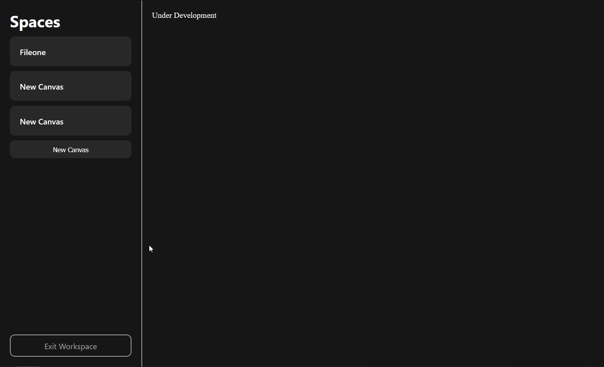

  
  <h1 align="center">Metaclip</h1>
  

    A self-hosted (for now) space to organize your digital things
     
    <a href="https://github.com/metaclip-app/metaclip/releases">Download</a>
  

Metaclip is a self-hosted app to store your digital archieves like images, videos, links, pages, bookmarks and more. It's an easy way to organize all the digital things we store more and more everyday and see it in a nice visual way. The project is only at the start and there's is a lot to do before letting it go public. Our goal is to only let it public on a perfect MVP.

If you want to test this new piece of digital chest we are proudly developing you can self-host our alpha.

## Getting Started
If you want to self-hosted the project it's actually a very simple thing. You only need to host a self-server with xampp and you'r good to go :)

### Installation
1. Download xampp at [sourceforge](https://sourceforge.net/projects/xampp/)
2. Install it using the intaller
3. Open it and click on start on the Apache and MySQL row
4. Extract the .zip on [releases](https://github.com/metaclip-app/metaclip/releases)
4. Move the extracted folder to xampp htdocs
5. Acess [localhost/metaclip/public/pages/app.php](http://localhost/metaclip/public/pages/app.php)
6. Favorite it for easy access
7. That's it :3

## Roadmap
-- 0.0.1 --
- [x] New database
- [x] New structure

-- 0.0.6 --

- [ ] Delete account
- [ ] List view
- [ ] Grid view
- [ ] About page

-- 1.0.0 --

- [ ] Better views
- [ ] Image upload and view
- [ ] New landing page

-- 1.4.0 --

- [ ] Audio upload and view
- [ ] Video upload and view
- [ ] Document upload and view
- [ ] Bookmarks integration

-- 1.5.2 --

- [ ] Folders
- [ ] Themes

See the [open issues](https://github.com/metaclip-app/metaclip/issues) for a full list of proposed features (and known issues).

## Contributing
Contributions are what make the open source community such an amazing place to learn, inspire, and create. Any contributions you make are **greatly appreciated**.

If you have a suggestion that would make this better, please fork the repo and create a pull request. You can also simply open an issue with the tag "enhancement".
Don't forget to give the project a star! Thanks again!

1. Fork the Project
2. Create your Feature Branch (`git checkout -b feature/AmazingFeature`)
3. Commit your Changes (`git commit -m 'Add some AmazingFeature'`)
4. Push to the Branch (`git push origin feature/AmazingFeature`)
5. Open a Pull Request

## License
Distributed under the GPL-3.0 License. See `LICENSE` for more information.
